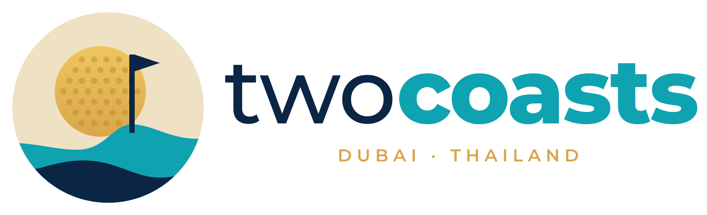

# TwoCoasts brand guidelines

Version 1.0 · September 2026

TwoCoasts is the umbrella brand for a family of apps, files and documents. This guide covers the idea behind the identity, the logo system, colour, typography and how to apply them, so everything we ship looks like it came from the same place.

<p align="center"></p>

---

## 1. The idea

**Slogan.** Two coasts. One clear view.

Use the slogan on hero areas, title slides and covers. The tagline "DUBAI · THAILAND" is a locator: it lives only inside the logo lockups and is never rewritten (not "DUBAI · PHUKET", not "UAE · THAILAND"). Dubai is the city, Thailand the country, because those are the two names people recognise.

**Name.** Write **TwoCoasts**, one word with a capital T and C, in all running text, titles, legal lines and product names. Lowercase "twocoasts" exists only in the drawn wordmark, URLs, handles and code. Never "Two Coasts", "twoCoasts" or "Two-Coasts".

The brand lives between two shorelines: the Arabian Gulf at Dubai and the Andaman coast of Thailand. Both are places of sand, warm water and golf played with the sea in view. The identity borrows from all three:

- **Dubai**: desert gold, sunlit sand, clear skies, a polished and premium feel.
- **Thailand**: lagoon turquoise, deep tropical water, an easy warmth.
- **Golf**: the dimpled ball, the flag on the green, the discipline of clean lines.

The mark is a golf ball rising like a sun over two waves. The upper wave is the Andaman, the lower, darker one the Gulf. A pin with a pennant stands on the crest, because on both coasts the game is played at the water's edge. Two waves, two coasts.

**Voice.** Calm, confident and specific. Short sentences. Numbers over adjectives. Warm but never gushing. Lead with the number, make one claim per sentence, and hedge with probabilities, never with adjectives. Never promise an outcome: we show probabilities and edges, and the reader decides.

| Say | Don't say |
|---|---|
| a clear view | a game-changing insight |
| a 61% edge | a sure thing |
| we estimate | we guarantee |
| +3.2% on the week | huge gains |
| worth backing | can't lose |

---

## 2. Logo system

All files are in `logo/svg/` (vector, use these whenever you can) with PNG renders in `logo/png/` at 1x and 2x. The wordmark is converted to outlines, so no font needs to be installed for the SVGs to render correctly.

| Asset | File | Use it for |
|---|---|---|
| **Primary logo** | `twocoasts-logo-primary.svg` | Default. Headers, documents, anything on white, ivory or sand. |
| Primary with tagline | `twocoasts-logo-primary-tagline.svg` | Covers, letterheads, hero areas, anywhere the logo is 200 px or wider. |
| **Reverse logo** | `twocoasts-logo-primary-reverse.svg` (+ `-tagline`) | On navy, charcoal, dark photos and the coast gradient. |
| **Stacked logo** | `twocoasts-logo-stacked-primary.svg` (+ `-tagline`) | Square spaces: social tiles, app splash screens, badges. |
| **Product lockup** | `twocoasts-logo-product-futures.svg` (+ `-reverse`) | Wordmark, a thin rule and the product name. The only way to show a product name with the brand. |
| Mono navy / white / black | `twocoasts-logo-mono-*.svg` | Single-colour print, embroidery, engraving, watermarks, co-branding rows where colour would clash. |
| **Mark (day)** | `twocoasts-mark-day.svg` | Icon-sized uses on light backgrounds: avatars, list icons, buttons. |
| Mark (night) | `twocoasts-mark-night.svg` | Icon-sized uses on dark backgrounds. |
| Mark mono | `twocoasts-mark-mono-*.svg` | One-colour icon uses. |
| Mark simplified | `twocoasts-mark-day-simple.svg`, `-night-simple` | Any use at 96 px or smaller: no dimples, thicker pin. |
| **App icon** | `twocoasts-app-icon.svg`, `twocoasts-app-icon-dark.svg` | iOS, Android, macOS, Windows and PWA icons. Rounded square, full bleed. |
| Wordmark | `twocoasts-wordmark*.svg` | Footers, page headers next to a product name, places the mark is shown separately. |
| Favicon | `logo/favicon/` | Ready-made set: `favicon.svg`, `.ico`, PNG sizes, Apple touch icon, PWA icons, `site.webmanifest`. |
| Social | `logo/social/` | Avatar, X/Twitter banner, LinkedIn banner, Open Graph image. |

### Choosing a version

1. White, ivory or a light photo: **primary**. On Sand or other warm panels use **mono navy**, so the mark's disc always shows.
2. Dark background (navy, charcoal, coast gradient, dark photo): **reverse**.
3. Only one ink, or the background is busy or a strong colour: **mono** navy, white or black, whichever contrasts most.
4. Space narrower than it is tall: **stacked**.
5. Smaller than 120 px wide: **mark** only.

### Clear space and minimum size

- Keep clear space of at least **half the mark's height** on all sides. Nothing else (text, other logos, edges) goes inside it.
- Minimum sizes: horizontal logo 120 px / 30 mm wide, stacked logo 80 px / 20 mm, mark 32 px, any one-colour version 48 px / 12 mm. At 96 px and below use the `-simple` marks; `favicon.svg` covers 16 to 48 px.
- Drop the tagline below 320 px / 80 mm wide (horizontal) or 240 px / 60 mm (stacked). Use the files without `-tagline` there.

### Don't

- Don't recolour the logo outside the supplied versions. Don't put the day mark on navy or the night mark on sand.
- Don't stretch, rotate, skew, add shadows, glows, outlines or gradients.
- Don't place the mark and wordmark in a new arrangement. Use the lockups provided.
- Don't set "twocoasts" in Montserrat to imitate the wordmark. Use the SVG.
- Don't put the colour logo on a busy photo without a solid or blurred panel behind it.
- Don't separate the flag or the sun from the mark. The mark is one object.

---

## 3. Colour

Source of truth: `colors/palette.json`. Ready-made exports: `colors/colors.css`, `colors/colors.scss`, `colors/tailwind.colors.js`, `colors/twocoasts.gpl` (GIMP, Inkscape, Krita).

### Core palette

| | Name | Hex | RGB | Role |
|---|---|---|---|---|
|  | **Gulf Navy** | `#0B2545` | 11, 37, 69 | Primary. Headings, dark surfaces, the lower wave. |
|  | **Andaman Teal** | `#0FA3B1` | 15, 163, 177 | Primary accent. The upper wave, "coasts". Large text and shapes only on white. |
|  | Deep Teal | `#0B7F8A` | 11, 127, 138 | Accessible teal: links, button fills, small text on light. |
|  | Lagoon | `#8EDCD9` | 142, 220, 217 | Tints, tags, highlights, the upper wave at night. |
|  | **Dubai Gold** | `#D9A64A` | 217, 166, 74 | The sun. Taglines on dark, premium accents. Decorative only on light backgrounds; never text outside the locked logo files. |
|  | Sunlit Gold | `#EFC65E` | 239, 198, 94 | Top of the Sun gradient only. Not for UI or text. |
|  | Bunker Gold | `#B8862E` | 184, 134, 46 | Gold text on light backgrounds (large sizes). Dimples. |
|  | **Sand** | `#F6ECD9` | 246, 236, 217 | Warm surfaces, cards, section backgrounds. |
|  | Ivory | `#FCFAF5` | 252, 250, 245 | Page background. |
|  | Fairway Green | `#2F9E6B` | 47, 158, 107 | Success, positive change, golf accents. |
|  | Sunset Coral | `#F0715F` | 240, 113, 95 | Errors, negative change, urgent highlights. |
|  | Charcoal | `#1E2A3A` | 30, 42, 58 | Body text. Dark-mode surface. |
|  | Driftwood | `#7A7266` | 122, 114, 102 | Secondary text, captions, borders. |

Mark only: Dune `#EFE1C4` is the sky in the day mark and Night Gulf `#123A63` the sky in the night mark. They give the badge a visible disc on white, ivory and navy. Don't use them as UI colours.

### Proportions

Think of a page as a beach: mostly Ivory and Sand, a strong line of Navy, a stripe of Teal, and Gold only where the sun hits.

- 60% Ivory / Sand / White
- 25% Gulf Navy (text, headers, dark panels)
- 10% Andaman Teal / Deep Teal (actions, links, highlights)
- 5% Dubai Gold, Fairway Green, Sunset Coral (accents and status only)

### Gradients

- **Coast**: `linear-gradient(120deg, #0B2545 0%, #123A63 60%, #0B7F8A 100%)` for hero panels, covers and banners.
- **Shore**: `linear-gradient(180deg, #FCFAF5 0%, #F6ECD9 100%)` for soft section backgrounds.
- **Sun**: `linear-gradient(180deg, #EFC65E, #D9A64A)` is used inside the mark only.

### Accessibility

Contrast ratios for every pairing are in `colors/contrast.md`. The short version:

- Text on light backgrounds: Gulf Navy, Charcoal, Deep Teal or Driftwood. Andaman Teal, gold, green and coral only at 18 px bold and above, or as shapes and icons. Gold is never text below 18 px on a light surface.
- Text on Gulf Navy: White, Sand, Lagoon, Dubai Gold, Andaman Teal all pass.
- Buttons: Deep Teal fill with white text (light mode), or Andaman Teal fill with navy text (dark mode). White on Andaman Teal is borderline; avoid it for small text.
- Positive and negative numbers use the text tokens (`#1F7A52` and `#C0472F` on light; `#4CBF8A` and `#FF8A78` on dark), not the badge fills.
- Status colours never carry meaning alone. Pair green and coral with a sign, an arrow or a label; the theme's up/down styles add the arrow for you.
- Badges on green or coral fills use navy text, not white.
- Hero body text on the Coast gradient is White, not Sand.

### Dark mode

Swap surfaces to `#071A33` / Gulf Navy, body text to Sand, headings to White, links to Lagoon, and use the night mark and reverse logo. `tokens/twocoasts.css` does this automatically from the system preference or `data-theme="dark"`.

---

## 4. Typography

Montserrat for headings, eyebrows, taglines, buttons, badges, navigation, table headers and hero KPI figures. Inter for running text, form fields, table cells, captions and any data column. Both are free (SIL OFL) and included in `fonts/`, including Inter Italic. Full scale and rules in `typography/typography.md`.

| Role | Face | Weight | Size |
|---|---|---|---|
| Hero | Montserrat | 800 | 48 to 64 px |
| H1 | Montserrat | 800 | 48 px |
| H2 | Montserrat | 700 | 36 px |
| H3 | Montserrat | 700 | 22 px |
| Eyebrow / tagline | Montserrat | 600, uppercase, +0.18 em | 12 px |
| Body | Inter | 400 | 16 px |
| Small / table | Inter | 400 | 14 px |
| Caption | Inter | 500 | 12 px |

The tagline "DUBAI · THAILAND" is always uppercase Montserrat 600 with wide tracking, in Dubai Gold, and only inside the logo files. Eyebrows (small uppercase labels above headings) are Deep Teal on light backgrounds and Dubai Gold on dark; uppercase labels use 0.18 em tracking for eyebrows and 0.08 em for badges, table headers and navigation.

---

## 5. Graphic language

- **The wave.** A single soft wave line can divide sections, sit under a heading, or run along the bottom of a slide. Use the shape from `.tc-wave` in `tokens/twocoasts.css` or copy the path from `tools/build.mjs`. One or two waves, never a pattern.
- **The dimple grid.** Fine dots on a gold or sand field can texture a cover or a card corner at low opacity (under 20%). Use sparingly.
- **Rounded shapes.** Corners of 12 px on cards and 20 px on panels; pill buttons. Nothing sharp-cornered except tables.
- **Photography.** Coastlines at golden hour, fairways beside water, clean architecture, wide horizons. Warm light, low contrast, real places. No stock handshakes, no neon.
- **Icons.** Simple two-tone line icons in Navy with a Teal or Gold accent. 2 px stroke at 24 px.

---

## 6. Applying the brand

### Apps and websites

1. Link `tokens/twocoasts.css` (fonts, tokens, light/dark, base components) or import `tokens/tokens.json` into your design tool. Copy `fonts/` with it: the stylesheet self-hosts the fonts. It follows the OS theme; force one with `data-theme="light"` or `data-theme="dark"` on the root element. Put both logo versions in the page with the `tc-logo-light` and `tc-logo-dark` classes and the theme shows the right one.
2. Copy `logo/favicon/*` next to your `index.html` and paste the `<link>` tags from `templates/app-shell.html`.
3. Use the primary logo in the header at 36 to 44 px tall, the reverse logo in dark mode, and the mark alone on mobile.
4. Tailwind: `colors/tailwind.colors.js`.

### Documents

- **Letters, reports, proposals**: start from `templates/letterhead.html` (A4, prints to PDF from any browser).
- **Word / Google Docs**: install the fonts from `fonts/`, use Montserrat 800 for the title, 700 for headings, Inter 11 pt for body. Put `twocoasts-logo-primary-tagline.svg` (or the `@2x` PNG) top-left at 18 mm wide, and the navy mono wordmark in the footer.
- **Slides**: navy title slide with the reverse logo centred at 80 mm wide on a coast gradient and the slogan beneath; ivory content slides with the primary logo bottom-right at 30 mm wide; Gold for the one number you want remembered. Title 40 pt Montserrat 800, section titles 28 pt Montserrat 700, body 18 to 20 pt Inter, captions 12 pt.
- **Office fonts**: install Montserrat and Inter from `fonts/`. If they cannot be installed, use Arial for both. Never substitute a serif.
- **Office theme colours** (PowerPoint and Word "Customize Colors"): Dark 1 Gulf Navy `#0B2545`, Light 1 Ivory `#FCFAF5`, Dark 2 Charcoal `#1E2A3A`, Light 2 Sand `#F6ECD9`, Accent 1 Deep Teal `#0B7F8A`, Accent 2 Dubai Gold `#D9A64A`, Accent 3 Andaman Teal `#0FA3B1`, Accent 4 Fairway Green `#2F9E6B`, Accent 5 Sunset Coral `#F0715F`, Accent 6 Driftwood `#7A7266`, Hyperlink Deep Teal.
- **Spreadsheets**: header row Gulf Navy with white Montserrat 600 text; alternate rows Ivory and Sand; positive numbers Fairway Green, negative Sunset Coral.
- **Email**: `templates/email-signature.html`.
- **READMEs and docs sites**: `templates/markdown-snippets.md`.

### Sub-brands and product names

Use the product lockup files (`twocoasts-logo-product-futures.svg` and `-reverse`): the wordmark, a thin rule, then the product name in Montserrat 500 at cap height. Never type it yourself. In prose write "TwoCoasts Futures" on first mention and "Futures" after that; never "Futures by TwoCoasts". Products do not get their own marks; they share the TwoCoasts mark and app icon.

### Co-branding

Our logo and a partner's sit on the same baseline, separated by a 1 px Driftwood rule with clear space on both sides. Match visual weight, not pixel height.

---

## 7. Files

```
branding/
├── BRAND_GUIDELINES.md         this document
├── README.md                   quick start
├── logo/
│   ├── svg/                    all logo variants (vector, preferred), incl. product lockups and -simple marks
│   ├── png/                    1x and 2x renders, mark size ladder
│   ├── favicon/                favicon.svg/.ico, PNGs, apple-touch-icon, PWA icons, site.webmanifest
│   └── social/                 avatar, X banner, LinkedIn banner, Open Graph image
├── colors/                     palette.json, colors.css, colors.scss, tailwind.colors.js, twocoasts.gpl, contrast.md
├── tokens/                     tokens.json (W3C design tokens), twocoasts.css (drop-in theme)
├── typography/                 typography.md, fonts.css
├── fonts/                      Montserrat, Inter and Inter Italic variable TTFs + OFL licences
├── reviews/                    design team review reports and the Creative Director's decisions
├── templates/                  letterhead, app shell, email signature, markdown snippets
├── preview/                    brand-sheet.html and brand-sheet.png
└── tools/build.mjs             regenerates every logo, PNG, favicon and social image
```

To change the logo or colours, edit `colors/palette.json` or the geometry in `tools/build.mjs`, then run `node branding/tools/build.mjs`. Never hand-edit files in `logo/`; they are overwritten.
